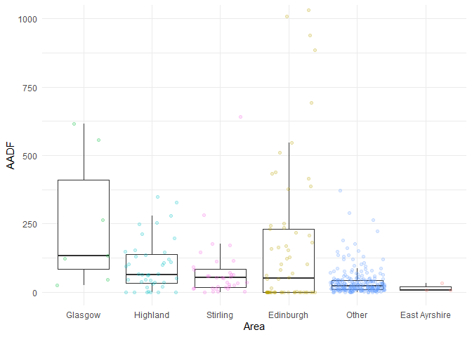
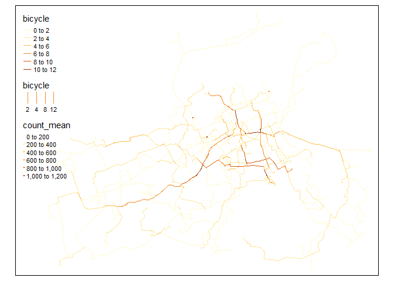
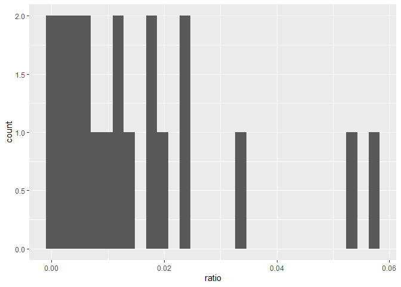
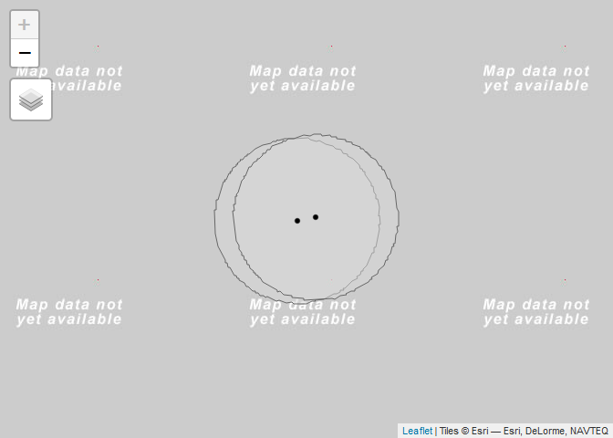

<!-- README.md is generated from README.Rmd. Please edit that file -->

# scottish-cycle-counts

<!-- badges: start -->
<!-- badges: end -->

The goal of scottish-cycle-counts is to read-in a process data on
cycling volumes in Scotland.

``` r
library(tidyverse)
```

First of all, a copy of the original files can be obtained with the code
below. This code is to be run just once.

``` r
dir.create("data_raw")
system("gh release download 1 --dir data_raw")
```

The input dataset is a single .zip file:

``` r
zipped_data = list.files(path = "data_raw",pattern = "\\.zip$",full.names = T)
zipped_data
```

We can unzip it as follows:

``` r
unzip(zipped_data, exdir = "data_raw")
```

``` r
files_csv = list.files("data_raw", pattern = "\\.csv$", full.names = TRUE)
files_csv
#>  [1] "data_raw/Aberdeen City Council.csv"                            
#>  [2] "data_raw/Aberdeenshire Council.csv"                            
#>  [3] "data_raw/City of Edinburgh Council.csv"                        
#>  [4] "data_raw/Comhairle nan Eilean Siar (Western Isles Council).csv"
#>  [5] "data_raw/East Ayrshire Council.csv"                            
#>  [6] "data_raw/East Dunbartonshire Council.csv"                      
#>  [7] "data_raw/Glasgow City Council.csv"                             
#>  [8] "data_raw/John Muir Way.csv"                                    
#>  [9] "data_raw/National Cycle Nework (Scotland) - Sustrans.csv"      
#> [10] "data_raw/National Monitoring Framework - Cycling Scotland.csv" 
#> [11] "data_raw/North Ayrshire Council.csv"                           
#> [12] "data_raw/Perth and Kinross Council.csv"                        
#> [13] "data_raw/Scotland North East Trunk Roads.csv"                  
#> [14] "data_raw/Scotland North West Trunk Roads.csv"                  
#> [15] "data_raw/Scotland South East Trunk Roads.csv"                  
#> [16] "data_raw/Scotland South West Trunk Roads.csv"                  
#> [17] "data_raw/South Ayrshire Council.csv"                           
#> [18] "data_raw/South Lanarkshire Council.csv"                        
#> [19] "data_raw/Stirling Council.csv"                                 
#> [20] "data_raw/The Highland Council.csv"
```

We can read this file in R as follows:

``` r
# library(data.table)
# counts = data.frame(data.table::rbindlist(lapply(files_csv,data.table::fread))) #DT's quick way to read the files 
counts = map_dfr(files_csv, read_csv,show_col_types = FALSE)
dim(counts)
#> [1] 230307     10
counts
#> # A tibble: 230,307 × 10
#>    area    count endTime             latitude location longitude provider siteID
#>    <chr>   <dbl> <dttm>                 <dbl> <chr>        <dbl> <chr>    <chr> 
#>  1 Aberde…    61 2023-06-14 00:00:00     57.1 A956 We…     -2.09 Aberdee… ABE65…
#>  2 Aberde…    26 2023-06-14 00:00:00     57.2 Dyce Dr…     -2.20 Aberdee… ABE918
#>  3 Aberde…    18 2023-06-14 00:00:00     57.2 Dyce Dr…     -2.22 Aberdee… ABE397
#>  4 Aberde…   158 2023-06-14 00:00:00     57.2 Ellon R…     -2.09 Aberdee… ABE920
#>  5 Aberde…   157 2023-06-14 00:00:00     57.1 Shell C…     -2.10 Aberdee… ABE229
#>  6 Aberde…   132 2023-06-14 00:00:00     57.2 Tillydr…     -2.11 Aberdee… ABE899
#>  7 Aberde…   395 2023-06-14 00:00:00     57.1 Deeside…     -2.10 Aberdee… ABE235
#>  8 Aberde…    20 2023-06-14 00:00:00     57.2 Farburn…     -2.17 Aberdee… ABE745
#>  9 Aberde…    91 2023-06-14 00:00:00     57.2 Parkway…     -2.10 Aberdee… ABE894
#> 10 Aberde…    39 2023-06-14 00:00:00     57.2 Site B …     -2.16 Aberdee… ABE288
#> # ℹ 230,297 more rows
#> # ℹ 2 more variables: startTime <dttm>, usmart_id <chr>
```

``` r
counts_monthly = counts |>
  mutate(
    year = year(endTime),
    month = month(endTime, label = TRUE),
    # date rounded to nearest month in 2020-01-01 format:
    date = lubridate::floor_date(endTime, unit = "month")
  ) |>
  group_by(date, area) |>
  summarise(
    count = sum(count)
  )
# Add column with names for most common areas:
# Most common areas are:
area_counts = counts_monthly |>
  group_by(area) |>
  summarise(
    count = sum(count)
  )

top_5_areas = area_counts |> 
  slice_max(count, n = 5)

# Add column that is area name if in top 5, else "Other":
counts_monthly_top = counts_monthly |>
  mutate(
    Area = ifelse(
      area %in% top_5_areas$area,
      area,
      "Other"
    )
  ) |>
  group_by(date, Area) |>
  summarise(
    count = sum(count)
  )
```

``` r
counts_monthly_top |>
  ggplot(aes(x = date, y = count, colour = Area)) +
  geom_line() +
  # Add log y-axis:
  scale_y_log10()
```

<!-- -->

A quick look at the data to check if there are sites with missing data
or duplicated records:

``` r
counts |>
  group_by(siteID,location) |> 
  unique() |> 
  count() |> 
  ggplot(aes(n))+geom_histogram(bins = 30)
```

<!-- -->

``` r
range(counts$startTime)
#> [1] "2022-06-01 UTC" "2023-06-13 UTC"
difftime(range(counts$startTime)[2],range(counts$startTime)[1],units = "days")
#> Time difference of 377 days
```

Each site should have a maximum of 378 days in the dataset. The
following code detects the sites with some type of duplication and the
ones with fewer records.

``` r
repeated_sites = counts |>
  group_by(siteID) |> 
  filter(n()>378) |> 
  select(siteID) |>
  unique()

repeated_sites$siteID  |> length()
#> [1] 22

fewer_sites = counts |>
  group_by(siteID) |> 
  filter(n()<300) |> 
  select(siteID) |>
  unique()

fewer_sites$siteID  |> length()
#> [1] 133
```

A subset of the clean sites is produced, so we can do some AADT
analysis. Records after 2023-06-01 are filtered out to have only one
year of data for each site

``` r

clean_counts = counts |>
  filter(startTime < as.Date("2023-06-01")) |> 
  anti_join(repeated_sites,by =join_by(siteID)) |>
  anti_join(fewer_sites,by =join_by(siteID)) |> 
  filter(n()==365,.by = siteID)

clean_counts |>
  group_by(siteID,location) |> 
  unique() |> 
  count() |> summary()
#>     siteID            location               n      
#>  Length:383         Length:383         Min.   :365  
#>  Class :character   Class :character   1st Qu.:365  
#>  Mode  :character   Mode  :character   Median :365  
#>                                        Mean   :365  
#>                                        3rd Qu.:365  
#>                                        Max.   :365
```

Here we calculate some statistics for the whole year including mean
(Average Annual Daily Flow), median daily flow, minimum and maximum
daily flows,

``` r
AADF_sites = clean_counts |> 
  summarise(across(count,list(mean = mean,
                              median = median,
                              min = min,
                              max = max)),.by = siteID)

AADF_sites
#> # A tibble: 383 × 5
#>    siteID  count_mean count_median count_min count_max
#>    <chr>        <dbl>        <dbl>     <dbl>     <dbl>
#>  1 ABE6535       19.9           18         1        50
#>  2 ABE896        44.1           43         0       195
#>  3 ABE6545       34.3           32         2        84
#>  4 ABE895        86.0           74         0       288
#>  5 ABE918        15.6           15         0        39
#>  6 ABE122        16.6           16         0        57
#>  7 ABE123        13.8           12         0        49
#>  8 ABE400        43.5           33         2       150
#>  9 ABE288        12.5            9         0        81
#> 10 ABE893        43.3           43         0        93
#> # ℹ 373 more rows
```

``` r
counts_per_area = counts |> select(siteID,area) |> unique()

AADF_sites |>
  left_join(counts_per_area,by = join_by(siteID)) |> 
  mutate(
    area = ifelse(
      area %in% top_5_areas$area,
      area,
      "Other"
    )) |> 
  ggplot(aes(x=fct_reorder(area,count_mean,.desc = T),
             y=count_mean))+
  geom_boxplot(outlier.shape = NA)+
  geom_jitter(aes(col = area),alpha = 0.2,shape = 19,show.legend = F)+
  coord_cartesian(ylim = c(0,1000))+
  theme_minimal()+
  labs(x = "Area",
       y = "AADF")
```

<!-- -->

We create a vector to store the bank holidays in Scotland extracted from
the [mygov.scot web](https://www.mygov.scot/scotland-bank-holidays)

``` r
scot_bank_holidays = as.Date(c("2022/06/03",
                               "2022/06/02",
                               "2022/08/1",
                               "2022/11/30",
                               "2022/12/25",
                               "2022/12/26",
                               "2022/12/27",
                               "2023/01/02",
                               "2023/01/03",
                               "2023/04/07",
                               "2023/05/01",
                               "2023/05/08",
                               "2023/05/29"))
```

We can calculate the same summary statistics by type of day: bank
holidays, weekends and weekdays (AAWDF).

``` r
ADF_dtype = clean_counts |> 
  mutate(d.type = case_when(as.Date(startTime) %in% scot_bank_holidays~"Bank Holiday",
                            wday(startTime,week_start = 1)<6~"Weekday",
                            TRUE~"Weekend")) |> 
  summarise(across(count,list(mean = mean,
                              median = median,
                              min = min,
                              max = max)),
            .by = c(siteID,d.type))

ADF_dtype
#> # A tibble: 1,149 × 6
#>    siteID  d.type  count_mean count_median count_min count_max
#>    <chr>   <chr>        <dbl>        <dbl>     <dbl>     <dbl>
#>  1 ABE6535 Weekday       23.6           22         6        50
#>  2 ABE896  Weekday       46.4           46         2       101
#>  3 ABE6545 Weekday       40.3           40         2        84
#>  4 ABE895  Weekday       78.1           65         1       247
#>  5 ABE918  Weekday       19.5           20         0        39
#>  6 ABE122  Weekday       17             16         0        50
#>  7 ABE123  Weekday       12.7           11         0        45
#>  8 ABE400  Weekday       40.1           31         2       110
#>  9 ABE288  Weekday       11.8            8         0        62
#> 10 ABE893  Weekday       52.6           52         6        93
#> # ℹ 1,139 more rows
```

``` r
counts_per_area = counts |> select(siteID,area) |> unique()

ADF_dtype |>
  left_join(counts_per_area,by = join_by(siteID)) |> 
  mutate(
    area = ifelse(
      area %in% top_5_areas$area,
      area,
      "Other"
    )) |> 
  ggplot(aes(x=fct_reorder(area,count_mean,.desc = T),
             y=count_mean))+
  geom_boxplot(outlier.shape = NA)+
  geom_jitter(aes(col = area),alpha = 0.2,shape = 19,show.legend = F)+
  coord_cartesian(ylim = c(0,1000))+
  facet_wrap(d.type~.,ncol = 2)+
  theme_minimal()+
  labs(x = "Area",
       y = "ADF")
```

<!-- -->

## Spatial Analysis

``` r
library(sf)
library(tmap)
```

The following code reads the network with the estimated commute trips
from the npt repository. Each edge/link of the network has four
attributes. We will focus on `bicycle` which is the estimated number of
daily commute trips in both directions.

``` r
rnet_commute = read_rds("../npt/outputs/rnet_commute.Rds")
rnet_commute
#> Simple feature collection with 1709 features and 4 fields
#> Geometry type: LINESTRING
#> Dimension:     XY
#> Bounding box:  xmin: -3.33653 ymin: 55.89548 xmax: -3.12415 ymax: 55.98413
#> Geodetic CRS:  WGS 84
#> First 10 features:
#>    bicycle bicycle_go_dutch Gradient Quietness                       geometry
#> 1        0                1        0        40 LINESTRING (-3.1547 55.9749...
#> 2        0                1        0        60 LINESTRING (-3.27797 55.911...
#> 3        0                1        2        70 LINESTRING (-3.27672 55.910...
#> 4        0                1        4        70 LINESTRING (-3.14531 55.969...
#> 5        0                1        0        80 LINESTRING (-3.27741 55.911...
#> 6        0                1        0        80 LINESTRING (-3.15282 55.976...
#> 7        0                1        1        80 LINESTRING (-3.17113 55.961...
#> 8        0                1        0        90 LINESTRING (-3.1547 55.9749...
#> 9        0                1        1        90 LINESTRING (-3.16781 55.961...
#> 10       0                1        1        90 LINESTRING (-3.16555 55.962...
```

A `sf` object is created from the `clean_counts` data frame. AADF for
each counts are joined using the `siteID`

``` r
sf_counts = clean_counts |>
  select(siteID,latitude,longitude,provider,location) |>
  unique() |>
  left_join(AADF_sites,by = "siteID") |>
  filter(count_mean > 0) |> 
  st_as_sf(coords = c("longitude","latitude"),crs = 4326)
sf_counts
#> Simple feature collection with 338 features and 7 fields
#> Geometry type: POINT
#> Dimension:     XY
#> Bounding box:  xmin: -7.307251 ymin: 54.91291 xmax: -1.15021 ymax: 60.1511
#> Geodetic CRS:  WGS 84
#> # A tibble: 338 × 8
#>    siteID  provider         location count_mean count_median count_min count_max
#>  * <chr>   <chr>            <chr>         <dbl>        <dbl>     <dbl>     <dbl>
#>  1 ABE6535 Aberdeen City C… A96 Auc…       19.9           18         1        50
#>  2 ABE896  Aberdeen City C… F&B Way…       44.1           43         0       195
#>  3 ABE6545 Aberdeen City C… A9119 Q…       34.3           32         2        84
#>  4 ABE895  Aberdeen City C… Beach E…       86.0           74         0       288
#>  5 ABE918  Aberdeen City C… Dyce Dr…       15.6           15         0        39
#>  6 ABE122  Aberdeen City C… Maidenc…       16.6           16         0        57
#>  7 ABE123  Aberdeen City C… Maidenc…       13.8           12         0        49
#>  8 ABE400  Aberdeen City C… Seaton …       43.5           33         2       150
#>  9 ABE288  Aberdeen City C… Site B …       12.5            9         0        81
#> 10 ABE893  Aberdeen City C… Welling…       43.3           43         0        93
#> # ℹ 328 more rows
#> # ℹ 1 more variable: geometry <POINT [°]>
```

A subset of the counts are taken based on a buffer of the `rnet_commute`
object.

``` r
rnet_buffer20 = rnet_commute |> st_buffer(dist = 20)

sf_counts_selected = sf_counts[rnet_buffer20,]
```

### Approach A

The nearest feature is joined to each point location

``` r
val_app1 = st_join(sf_counts_selected,rnet_commute,join = st_nearest_feature)
val_app1
#> Simple feature collection with 15 features and 11 fields
#> Geometry type: POINT
#> Dimension:     XY
#> Bounding box:  xmin: -3.22415 ymin: 55.9299 xmax: -3.17567 ymax: 55.95377
#> Geodetic CRS:  WGS 84
#> # A tibble: 15 × 12
#>    siteID  provider         location count_mean count_median count_min count_max
#>  * <chr>   <chr>            <chr>         <dbl>        <dbl>     <dbl>     <dbl>
#>  1 EDH0030 City of Edinbur… Dalry R…     1009.           331        40     27670
#>  2 EDH0037 City of Edinbur… Whiteho…      437.           457        54       753
#>  3 EDH0045 City of Edinbur… Melvill…      128.           128        13       266
#>  4 EDH0022 City of Edinbur… North M…      885.           888        99      1839
#>  5 EDH0035 City of Edinbur… A90 Dea…      415.           361        36       857
#>  6 EDH0039 City of Edinbur… Bruntsf…      218.           236         0       481
#>  7 EDH0043 City of Edinbur… Melvill…     1099.          1109       242      1813
#>  8 EDH0041 City of Edinbur… Mayfiel…      152.             0         0       683
#>  9 EDH0044 City of Edinbur… Melvill…      251.           257        32       446
#> 10 EDH0040 City of Edinbur… Mayfiel…      236.           225        19       581
#> 11 EDH0023 City of Edinbur… North M…      206.           205        21       400
#> 12 EDH0038 City of Edinbur… Bruntsf…      242.           251        32       420
#> 13 EDH0027 City of Edinbur… Harriso…      433.           455         0      1182
#> 14 EDH0021 City of Edinbur… Morriso…       68.7           63         8       416
#> 15 SUS5661 Sustrans         Edinbur…     1031.          1067        55      1753
#> # ℹ 5 more variables: geometry <POINT [°]>, bicycle <dbl>,
#> #   bicycle_go_dutch <dbl>, Gradient <dbl>, Quietness <dbl>
```

``` r
tm_shape(rnet_commute)+
  tm_lines(col = "bicycle",lwd = "bicycle")+
  tm_shape(val_app1)+
  tm_dots(col = "count_mean")
```

<!-- -->

``` r
val_app1 |> 
  st_drop_geometry() |>
  mutate(ratio = bicycle/count_mean) |> 
  ggplot(aes(ratio))+
  geom_histogram()
```

<!-- -->

``` r
val_app1 |>
  st_drop_geometry() |>
  ggplot(aes(x = count_mean,
             y = bicycle))+
  geom_point()+
  geom_smooth(method = "lm",
              formula = 'y ~ x',
              se = F)
```

<!-- -->

### Approach B

The previous approach assigned a count site to each road link based. So
far, it has not been addressed the fact that counts might be reporting
uni-directional flows along specific links.

Using the `sf_counts_selected` object, we produce a buffer of 30 metres
from each count site.

``` r
sel_counts_buf30 = st_buffer(sf_counts_selected,dist = 30)
```

All overlaps within the `sel_counts_buf30` are identified using the
following code.

``` r
counts_overlap = st_intersects(sel_counts_buf30, sel_counts_buf30)
```

Some overlaps might reveal count sites reporting flows of different
directions on the same edge/link. For example, the sites EDH0040 and
EDH0041 which are located on Mayfield Road.

``` r
tmap_mode("view")
tm_shape(sel_counts_buf30[sel_counts_buf30$siteID %in% c("EDH0040","EDH0041"),])+
  tm_polygons(alpha = 0.5)+
  tm_shape(sf_counts_selected)+
  tm_dots()
```

<!-- -->

A more complex instance is the overlap of sensors on Melville Dr, two of
the sensors report flows on the main road and the other has data of the
adjacend path.

``` r
tmap_mode("view")
tm_shape(sel_counts_buf30[sel_counts_buf30$siteID %in% c("EDH0042","EDH0043","EDH0044","EDH0045"),])+
  tm_polygons(alpha=0.3)+
  tm_shape(sf_counts_selected)+
  tm_dots()
```

<!-- -->

The following code aggregates some of the overlapping counts using the
`location` attribute as aggregation criteria.

``` r
grouped_counts =
  do.call(rbind,
          lapply(unique(counts_overlap),
                 function(x) {
                   tmp_group = sf_counts_selected[x,]
                   
                   # Count aggreagation
                   simp_data = tmp_group |>
                     # Removing the direction from the location string
                     mutate(location = str_remove(location,
                                                  "\\s\\w*bound")) |>
                     st_drop_geometry() |>
                     # Extracting the first value for the siteID,
                     # provider and adds up the counts for sites with
                     # the same 'location'
                     summarise(across(c("siteID", "provider"),
                                      \(x) head(x, n = 1)),
                               across(starts_with("count_"), sum),
                               .by =  "location")
                   
                   simp_group = tmp_group |>
                     select(siteID) |>
                     filter(siteID %in% simp_data$siteID)
                   
                   simp_counts = simp_group |>
                     left_join(simp_data, by = "siteID") |>
                     relocate(location, .after = provider) |>
                     relocate(geometry, .after = count_max)
                   
                   return(simp_counts)
                 }))
```

As in the previous approach, the count sites are joined to the nearest
feature in the `rnet_commute` network.

``` r
grouped_counts$nearest_edge = st_nearest_feature(grouped_counts,
                                                 rnet_commute,
                                                 check_crs = T)


val_app2 = cbind(grouped_counts,st_drop_geometry(rnet_commute)[grouped_counts$nearest_edge,])
```

The following code shows the counts with the corresponding network
edges/links.

``` r
tm_shape(grouped_counts)+
  tm_dots()+
  tm_shape(rnet_commute[grouped_counts$nearest_edge,])+
  tm_lines()
```

<!-- -->

    #>   |                                                           |                                                   |   0%  |                                                           |.                                                  |   1%                     |                                                           |.                                                  |   3% [unnamed-chunk-36]  |                                                           |..                                                 |   4%                     |                                                           |...                                                |   6% [unnamed-chunk-37]  |                                                           |....                                               |   7%                     |                                                           |....                                               |   9% [unnamed-chunk-38]  |                                                           |.....                                              |  10%                     |                                                           |......                                             |  12% [unnamed-chunk-39]  |                                                           |.......                                            |  13%                     |                                                           |.......                                            |  14% [unnamed-chunk-40]  |                                                           |........                                           |  16%                     |                                                           |.........                                          |  17% [unnamed-chunk-41]  |                                                           |..........                                         |  19%                     |                                                           |..........                                         |  20% [unnamed-chunk-42]  |                                                           |...........                                        |  22%                     |                                                           |............                                       |  23% [unnamed-chunk-43]  |                                                           |.............                                      |  25%                     |                                                           |.............                                      |  26% [unnamed-chunk-44]  |                                                           |..............                                     |  28%                     |                                                           |...............                                    |  29% [unnamed-chunk-45]  |                                                           |................                                   |  30%                     |                                                           |................                                   |  32% [unnamed-chunk-46]  |                                                           |.................                                  |  33%                     |                                                           |..................                                 |  35% [unnamed-chunk-47]  |                                                           |..................                                 |  36%                     |                                                           |...................                                |  38% [unnamed-chunk-48]  |                                                           |....................                               |  39%                     |                                                           |.....................                              |  41% [unnamed-chunk-49]  |                                                           |.....................                              |  42%                     |                                                           |......................                             |  43% [unnamed-chunk-50]  |                                                           |.......................                            |  45%                     |                                                           |........................                           |  46% [unnamed-chunk-51]  |                                                           |........................                           |  48%                     |                                                           |.........................                          |  49% [unnamed-chunk-52]  |                                                           |..........................                         |  51%                     |                                                           |...........................                        |  52% [unnamed-chunk-53]  |                                                           |...........................                        |  54%                     |                                                           |............................                       |  55% [unnamed-chunk-54]  |                                                           |.............................                      |  57%                     |                                                           |..............................                     |  58% [unnamed-chunk-55]  |                                                           |..............................                     |  59%                     |                                                           |...............................                    |  61% [unnamed-chunk-56]  |                                                           |................................                   |  62%                     |                                                           |.................................                  |  64% [unnamed-chunk-57]  |                                                           |.................................                  |  65%                     |                                                           |..................................                 |  67% [unnamed-chunk-58]  |                                                           |...................................                |  68%                     |                                                           |...................................                |  70% [unnamed-chunk-59]  |                                                           |....................................               |  71%                     |                                                           |.....................................              |  72% [unnamed-chunk-60]  |                                                           |......................................             |  74%                     |                                                           |......................................             |  75% [unnamed-chunk-61]  |                                                           |.......................................            |  77% [unnamed-chunk-62]  |                                                           |........................................           |  78%                     |                                                           |.........................................          |  80% [unnamed-chunk-63]  |                                                           |.........................................          |  81%                     |                                                           |..........................................         |  83% [unnamed-chunk-64]  |                                                           |...........................................        |  84%                     |                                                           |............................................       |  86% [unnamed-chunk-65]  |                                                           |............................................       |  87%                     |                                                           |.............................................      |  88% [unnamed-chunk-66]  |                                                           |..............................................     |  90%                     |                                                           |...............................................    |  91% [unnamed-chunk-67]  |                                                           |...............................................    |  93%                     |                                                           |................................................   |  94% [unnamed-chunk-68]  |                                                           |.................................................  |  96%                     |                                                           |.................................................. |  97% [unnamed-chunk-69]  |                                                           |.................................................. |  99%                     |                                                           |...................................................| 100% [unnamed-chunk-70]
    #> [1] "counts.R"
